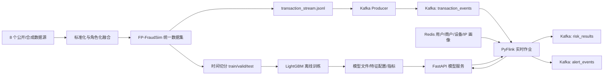

# 方向一：欺诈交易智能识别答辩方案 v1

## 1. 项目定位

本项目选择赛题方向一“欺诈交易智能识别”，面向第三方支付跨时段、跨渠道交易风控场景，构建了一个从仿真数据、离线训练、在线推理到 Kafka + Flink 实时流式检测的最小闭环系统。

当前系统已经完成：

```text
8 个公开/合成数据源
    -> FP-FraudSim 多源异构统一数据集
    -> LightGBM 离线训练
    -> FastAPI 模型服务
    -> Kafka 交易流回放
    -> Flink 在线窗口特征计算
    -> Redis 画像关联
    -> risk_results / alert_events 实时输出
```

项目当前更接近“可演示、可复现、可迭代的工程 MVP”，已经覆盖评分项中的实时检测、流式框架、多维特征和模型迭代基础能力；但图模型、解释性、动态自适应学习、安全加固和性能压测仍需要作为后续增强点继续补齐。

## 2. 系统架构



容器化部署已经实现，核心组件包括：

| 组件 | 当前实现 | 作用 |
|---|---|---|
| Kafka | `apache/kafka:3.7.0` KRaft 单节点 | 交易事件、风险结果、告警事件消息总线 |
| Flink | PyFlink 1.18 | 实时消费交易、维护窗口状态、调用模型服务 |
| Redis | Redis 7 | 存储用户、商户、设备、IP 静态画像 |
| Model API | FastAPI | 加载 LightGBM 模型并返回风险分、风险等级和处置动作 |
| Trainer | Python + LightGBM | 离线训练、评估、生成模型产物 |

## 3. 数据集构建效果

FP-FraudSim 不是简单拼接多个 CSV，而是按业务角色进行融合：

| 数据源 | 在本项目中的角色 |
|---|---|
| PaySim | 移动支付、转账、提现等交易骨架 |
| BankSim | 用户属性、商户类别、用户-商户消费网络 |
| IEEE-CIS | 电商支付、卡、设备、身份和高维匿名特征 |
| CreditCard Fraud | 极度类别不平衡欺诈识别对照 |
| Elliptic Bitcoin | 非法资金流图和链路结构 |
| DGraph-Fin | 金融用户关系图和风险传播 |
| SAML-D | 大规模 AML 交易流和流式压测来源 |
| AMLSim | 洗钱链路、环路、扇入扇出等仿真模式参考 |

统一后形成以下核心资产：

| 产物 | 作用 |
|---|---|
| `transaction_log.parquet` | 统一交易主表 |
| `user_profile.parquet` | 用户/账户行为画像 |
| `merchant_profile.parquet` | 商户收款与投诉/拒付画像 |
| `device_profile.parquet` | 设备指纹、模拟器、代理设备信息 |
| `ip_geo_profile.parquet` | IP、地理位置、代理/VPN 信息 |
| `graph_nodes.parquet` / `graph_edges.parquet` | 用户、交易、商户、设备、IP、资金流的异构图 |
| `transaction_stream.jsonl` | 可直接回放到 Kafka 的交易流 |
| `splits/train/valid/test.parquet` | 按时间切分的监督训练数据 |

异构融合主要解决了四类问题：

| 问题 | 处理方式 |
|---|---|
| 字段不同 | 统一到交易主表、画像表、图表、特征侧表四类结构 |
| ID 冲突 | 给不同数据源 ID 加来源前缀，保证全局唯一 |
| 时间尺度不同 | 将 step、秒级偏移、真实时间、图时间步统一映射到 2026-01-01 至 2026-03-31 时间轴 |
| 数据用途不同 | 交易型数据进入主表，关系型数据进入图，高维匿名字段保留为特征侧表 |

时间切分采用金融风控更合理的方式：按 `timestamp` 排序后，过去数据训练、后续数据验证和测试，避免随机切分带来的未来信息泄露。

## 4. 当前模型效果

当前主模型为 LightGBM，训练数据版本为 `fp_fraudsim_injected`，测试集指标如下：

| 指标 | 当前结果 |
|---|---:|
| 训练样本 | 566,795 |
| 验证样本 | 124,289 |
| 测试样本 | 123,649 |
| 特征数 | 50 |
| PR-AUC | 0.8925 |
| ROC-AUC | 0.9766 |
| F1（高风险阈值 0.80） | 0.8188 |
| FPR（阈值 0.80） | 0.0027 |
| Recall@Top1% | 0.1157 |

在阈值 `0.80` 下，模型更偏向低误报策略：

| 项目 | 数值 |
|---|---:|
| Precision | 0.9612 |
| Recall | 0.7132 |
| F1 | 0.8188 |
| 误报数 | 308 |
| 漏报数 | 3,065 |

答辩解读：

```text
高风险阈值 0.80 适合“拒绝/强审核”场景，误报率低，人工审核压力小。
中风险阈值 0.50 适合“扩大召回/人工复核”场景，召回率更高但误报更多。
TopK 指标适合反诈运营队列，把最可疑的前 1%/5% 交易优先交给人工研判。
```

需要注意：基础版 `fp_fraudsim` 的 PR-AUC 为 0.7272，ROC-AUC 为 0.9549，但固定阈值 0.5/0.8 下几乎不触发正类，说明不同数据版本之间概率分布不一致，后续必须做阈值校准和分数据版本评估。

## 5. 实时检测能力

当前已经跑通的实时链路：

```text
transaction_stream.jsonl
    -> Producer 按时间顺序写入 Kafka transaction_events
    -> Flink 消费交易流
    -> Flink 计算用户/设备/IP/商户窗口特征
    -> Flink 从 Redis 补充静态画像
    -> Flink 调用 FastAPI /predict
    -> 输出 risk_results
    -> 高风险交易额外输出 alert_events
```

Flink 当前计算的最小窗口特征包括：

| 维度 | 特征含义 |
|---|---|
| 用户 | 5 分钟交易次数和金额、1 小时交易次数和金额、1 小时收款方去重数 |
| 设备 | 10 分钟关联用户数 |
| IP | 10 分钟关联用户数 |
| 商户 | 1 小时交易次数、金额和、独立用户数 |

输出结果包含原始交易、窗口特征、画像字段、`risk_score`、`risk_level`、`decision`、模型名称、模型版本和打分时间。高风险或拒绝交易会进入 `alert_events`，方便后续对接前端、日志系统或人工审核台。

当前演示链路已经验证：

| 验收项 | 状态 |
|---|---|
| Kafka / Redis / FastAPI / Flink 容器启动 | 已完成 |
| Redis 画像加载 | 已完成 |
| Producer 写入交易流 | 已完成 |
| Flink 消费并输出风险结果 | 已完成 |
| 高风险交易进入告警 Topic | 已完成 |

## 6. 对评分项的当前评估

### 6.1 仿真环境与实时检测能力（5 分）

当前预计：4/5。

优势：

- 已构建 FP-FraudSim 多源异构仿真数据集，包含正常交易、欺诈交易、用户画像、设备/IP/商户画像和图结构。
- 支持 `transaction_stream.jsonl` 回放，能够模拟按时间发生的交易流。
- 模型服务能在交易进入流式链路后实时输出风险分、风险等级和处置动作。

短板：

- 当前交易生成主要是离线构建后的回放，还不是一个可交互调参的在线仿真器。
- 当前没有前端 Dashboard，演示主要依赖 Kafka topic、API 和日志。
- 实时性能尚未系统压测。

### 6.2 流式数据处理框架（5 分）

当前预计：4/5。

优势：

- 已经采用 Kafka + Flink + Redis + FastAPI 的真实流式架构，而不是单机 Python consumer 替代。
- Kafka 使用 `transaction_events`、`risk_results`、`alert_events` 做事件解耦。
- Flink 负责窗口特征计算、画像关联和模型服务调用。
- Docker Compose 能一键启动基础设施。

短板：

- 当前 PyFlink 作业为了 MVP 简化，窗口状态主要用 Python 内存结构维护，尚未启用 Flink checkpoint/state backend。
- 当前代码解析了事件时间，但没有完整实现 watermark、迟到数据侧输出和 exactly-once 语义。
- 调用模型 API 是同步请求，高吞吐下会成为瓶颈。

### 6.3 自适应学习与模型迭代能力（5 分）

当前预计：2.5/5。

优势：

- 已有统一模型 adapter，LightGBM 首版已接入。
- 已生成 `metrics.json`、`feature_config.json`、`leaderboard.json`，支持后续模型横向对比。
- `/reload` 支持模型服务热加载新模型。
- 数据集中保留 `unlabeled` 和可注入欺诈样本版本，具备继续迭代的基础。

短板：

- 当前还没有自动收集 `feedback_events` 并触发增量训练。
- 还没有模型漂移监控、阈值自动校准和 A/B 测试机制。
- 当前只训练了 LightGBM，XGBoost、CatBoost、IsolationForest、图模型仍是预留接口。

### 6.4 多维度特征构建（5 分）

当前预计：4/5。

优势：

- 已融合交易基础特征、时间特征、用户画像、设备画像、IP 画像和商户画像。
- 数据层已经准备异构图，可支撑团伙欺诈、资金链路和关联溯源。
- 在线链路已经计算用户/设备/IP/商户窗口特征。

短板：

- 当前 LightGBM 训练特征配置还没有把在线窗口特征纳入监督训练，窗口特征目前主要进入输出解释和后续扩展。
- 图特征还没有转化为 `graph_risk_score`、`community_id`、`two_hop_fraud_neighbor_ratio` 等可训练特征。
- 解释性目前主要依赖字段和风险分，还没有 SHAP、规则证据和图路径证据。

## 7. 当前实现的核心亮点

1. 数据构建不是简单拼表，而是将多源数据按交易、画像、图、特征侧表分层融合，符合真实金融风控的数据组织方式。
2. 训练采用时间切分，避免未来信息泄露，比随机切分更贴近线上部署。
3. 模型指标同时关注 PR-AUC、F1、误报率和 TopK 召回，适合欺诈检测的不平衡场景。
4. 系统不是停留在 Notebook 训练，而是形成了 Kafka + Flink + API + Redis 的可运行工程闭环。
5. 模型产物包含特征配置和版本号，API 推理与训练特征对齐，为后续多模型对比和模型热更新打下基础。

## 8. 当前风险与答辩应对

| 评委可能追问 | 建议回答 |
|---|---|
| 为什么用仿真/公开数据，不用真实金融数据？ | 真实金融交易涉及隐私和合规，公开获取困难；本项目通过公开数据和合成字段模拟多渠道、多实体、多欺诈类型场景，并保留图结构和流式回放能力。 |
| 为什么选择 LightGBM？ | 表格风控场景中 LightGBM 训练快、可解释性较好、适合类别不平衡数据，是强 baseline；后续接口已预留 XGBoost、CatBoost、IsolationForest 和图模型。 |
| 低误报和高召回如何平衡？ | 使用多阈值策略：高风险阈值用于拒绝，中风险阈值用于人工复核，TopK 队列用于运营优先级。 |
| 是否真正使用 Flink？ | 是。当前容器链路中 Flink 从 Kafka 消费交易流，计算窗口特征，关联 Redis 画像，调用模型 API，并写回风险结果和告警 Topic。 |
| 是否具备自适应学习？ | 当前具备模型迭代基础，包括统一 adapter、leaderboard、模型热加载和注入样本版本；完整的反馈闭环和自动重训是下一阶段重点。 |
| 是否能解释团伙欺诈？ | 数据层已经有用户、交易、设备、IP、商户和资金流图；当前还没有完整图模型，下一步会加入图统计、社区发现和证据路径输出。 |

## 9. 需要进一步补齐的需求规划

### 阶段一：比赛演示增强，优先级最高

目标：把当前 MVP 打磨成答辩现场稳定可展示的版本。

- 增加 `demo_run.ps1`，一键完成启动容器、加载画像、回放交易、消费风险结果。
- 增加 `demo_check.ps1`，自动检查 Kafka、Flink、Redis、API、模型文件和 Topic 状态。
- 增加一个轻量 Dashboard 或 Streamlit 页面，展示交易流、风险分布、高风险告警和最新模型指标。
- 为 `risk_results` 增加 `reason_codes`，例如“高频交易”“同 IP 多用户”“商户集中收款”“代理 IP”。
- 补充 README 中的现场演示脚本和失败恢复步骤。

预期收益：提高成熟度和团队表现分，降低现场演示风险。

### 阶段二：让在线窗口特征真正进入模型

目标：解决当前“Flink 已计算窗口特征，但 LightGBM 尚未训练使用”的问题。

- 在离线训练阶段基于历史交易按时间滚动生成同名窗口特征。
- 将窗口特征加入 `feature_config.json`。
- 重新训练 LightGBM，并比较加入窗口特征前后的 PR-AUC、F1、FPR、Recall@TopK。
- 确保离线窗口计算和 Flink 在线窗口计算字段名、窗口口径、缺失值策略完全一致。

预期收益：显著增强多维特征构建得分，也让实时检测更有说服力。

### 阶段三：自适应学习闭环

目标：补齐赛题明确要求的模型迭代能力。

推荐闭环：

```text
risk_results
    -> 人工审核/规则复核
    -> feedback_events
    -> feedback_pool.parquet
    -> 定时重训 LightGBM
    -> 生成 challenger 模型
    -> 与 champion 模型比较
    -> 通过后 reload 到线上服务
```

具体实现：

- 新增 `feedback_events` Topic。
- 新增反馈消费脚本，将人工审核标签落盘到 `data/feedback/`。
- 新增 `train_with_feedback.py`，合并新增标签样本后重训。
- leaderboard 增加模型版本、训练时间、数据版本、阈值、线上观测指标。
- 增加 champion/challenger 模型目录，支持灰度切换。

预期收益：完成自适应学习与模型迭代能力，从 2.5/5 提升到 4/5 以上。

### 阶段四：图分析与团伙溯源

目标：补齐赛题鼓励项“图神经网络或图分析方法”和“欺诈链路挖掘”。

最小可落地做法：

- 基于 `graph_edges.parquet` 构建 NetworkX 图。
- 计算用户、设备、IP、商户的度数、PageRank、共享设备/IP 规模、两跳欺诈邻居比例。
- 使用 Louvain/Leiden 社区发现，输出 `community_id` 和 `community_fraud_ratio`。
- 将图统计特征加入 LightGBM。
- 对高风险结果输出证据路径，例如“用户 A -> 设备 D -> 用户 B -> 高风险交易”。

进阶做法：

- 训练 Node2Vec 或 GraphSAGE，生成节点 embedding。
- 将 embedding 与交易特征拼接训练 LightGBM 或 MLP。
- 对团伙风险输出子图和关联路径。

预期收益：提升创新性、多维特征、解释性和实用性。

### 阶段五：流式工程加固与性能压测

目标：让 Kafka + Flink 链路更接近真实生产。

- 启用 Flink checkpoint 和 RocksDB state backend。
- 正式使用 event time watermark，增加 late_events Topic。
- 将同步 API 调用改为异步 I/O 或批量推理。
- 增加 Kafka 分区，按 `payer_id` 分区保证同用户局部有序。
- 使用 Locust 或自定义 producer 压测吞吐量、端到端延迟、P95/P99 延迟。
- 记录性能测试报告：输入速率、处理速率、平均延迟、P95/P99、资源占用、失败率。

预期收益：提升流式框架、实用性、成熟度。

### 阶段六：安全与混合云部署说明

目标：补齐安全性 20 分中的关键答辩内容。

- 数据侧：说明全部使用公开/合成/脱敏数据，统一 ID 前缀不包含真实个人信息。
- 传输侧：规划 Kafka SASL/SSL、API HTTPS、Redis 密码和内网访问。
- 服务侧：API 增加鉴权、限流、请求日志脱敏。
- 部署侧：补充混合云架构图，本地/私有云承载数据与模型，公有云只承载弹性计算或展示层。
- 审计侧：风险结果、模型版本、特征配置、阈值和决策动作全部留痕，方便追溯。

预期收益：补齐安全性和实用性，不让系统只停留在算法展示。

## 10. 推荐答辩结构

建议 8 到 10 分钟答辩按以下节奏：

| 时间 | 内容 |
|---:|---|
| 1 分钟 | 赛题理解：第三方支付实时欺诈识别，难点是多源异构、实时、低误报、可迭代 |
| 2 分钟 | 数据构建：8 个数据源角色化融合，形成交易、画像、图、流式事件 |
| 2 分钟 | 系统架构：Kafka + Flink + Redis + FastAPI + LightGBM，展示实时链路 |
| 1.5 分钟 | 模型效果：PR-AUC、ROC-AUC、F1、误报率、阈值策略 |
| 1 分钟 | 演示：交易回放、风险结果、高风险告警 |
| 1 分钟 | 创新与扩展：反馈学习、图分析、解释性、混合云安全部署 |
| 0.5 分钟 | 总结：当前 MVP 已跑通闭环，后续重点增强自适应学习和图溯源 |

## 11. 当前结论

当前实现已经能支撑方向一的基础答辩：有多源异构仿真数据、有真实流式框架、有离线模型训练、有在线风险评分、有高风险告警输出。

最需要补齐的不是再换一个复杂模型，而是三个能直接提高评分说服力的点：

1. 将在线窗口特征离线复现并纳入模型训练。
2. 建立 `feedback_events -> 重训 -> leaderboard -> reload` 的模型迭代闭环。
3. 增加图统计/社区发现/证据路径，让团伙欺诈和溯源分析从“数据已具备”变成“系统已输出”。

完成这三点后，项目会从“工程 MVP”升级为更贴近赛题要求的“实时智能反诈系统”。
