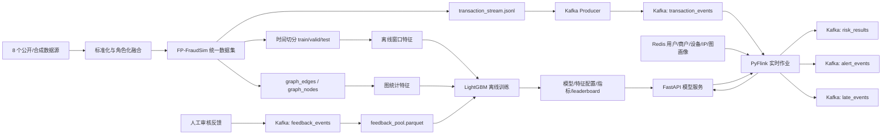

# 方向一：欺诈交易智能识别答辩方案 v2

## 1. 项目定位

本项目选择赛题方向一“欺诈交易智能识别”，面向第三方支付跨时段、跨渠道交易风控场景，构建了一个可训练、可流式回放、可在线推理、可反馈迭代的智能反诈系统。

v2 相比 v1 的主要变化：

```text
阶段一：新增演示检查脚本和一键演示脚本
阶段二：离线训练接入与 Flink 同口径的窗口特征
阶段三：新增 feedback_events、反馈落盘和带反馈重训入口
阶段四：新增图统计特征、图画像加载和 reason_codes
阶段五：新增 checkpoint 配置、迟到事件标记/输出和端到端压测脚本
增强补充：新增 Dashboard 实时 Topic 查看、人工审核反馈提交、模型热插拔和阈值校准
```

当前系统链路：

```text
8 个公开/合成数据源
    -> FP-FraudSim 多源异构统一数据集
    -> 离线窗口特征 + 图统计特征
    -> LightGBM 训练与评估
    -> FastAPI 模型服务
    -> Kafka 交易流回放
    -> Flink 在线窗口特征计算 + Redis 画像关联
    -> risk_results / alert_events / late_events
    -> feedback_events
    -> 反馈样本重训与模型热加载
```

## 2. 系统架构



核心容器和脚本：

| 组件 | 当前实现 | 作用 |
|---|---|---|
| Kafka | `apache/kafka:3.7.0` KRaft 单节点 | 交易、风险、告警、反馈事件消息总线 |
| Flink | PyFlink 1.18 | 实时窗口特征、画像关联、模型服务调用、迟到事件标记 |
| Redis | Redis 7 | 用户、商户、设备、IP、图统计画像 |
| Model API | FastAPI | 模型加载、风险评分、风险等级、处置动作、理由码 |
| Trainer | Python + LightGBM | 离线训练、反馈重训、指标和 leaderboard |
| Demo | `scripts/demo_run.ps1` / `scripts/demo_check.ps1` | 现场演示启动和健康检查 |
| Benchmark | `python -m fraudsim.streaming.benchmark` | 端到端吞吐和延迟测试 |
| Dashboard | `http://localhost:8000/dashboard` | 模型热切换、实时消息查看、人工反馈提交 |

## 3. 数据集构建效果

FP-FraudSim 采用角色化融合，而不是简单拼接：

| 数据源 | 在本项目中的角色 |
|---|---|
| PaySim | 移动支付、转账、提现等交易骨架 |
| BankSim | 用户属性、商户类别、用户-商户消费网络 |
| IEEE-CIS | 电商支付、卡、设备、身份和高维匿名特征 |
| CreditCard Fraud | 极度类别不平衡欺诈识别对照 |
| Elliptic Bitcoin | 非法资金流图和链路结构 |
| DGraph-Fin | 金融用户关系图和风险传播 |
| SAML-D | 大规模 AML 交易流和流式压测来源 |
| AMLSim | 洗钱链路、环路、扇入扇出等仿真模式参考 |

统一后形成：

| 产物 | 作用 |
|---|---|
| `transaction_log.parquet` | 统一交易主表 |
| `user_profile.parquet` | 用户/账户行为画像 |
| `merchant_profile.parquet` | 商户收款、投诉、拒付画像 |
| `device_profile.parquet` | 设备指纹、模拟器、代理设备信息 |
| `ip_geo_profile.parquet` | IP、地理位置、代理/VPN 信息 |
| `graph_nodes.parquet` / `graph_edges.parquet` | 用户、交易、商户、设备、IP、资金流异构图 |
| `graph_entity_features.parquet` | v2 新增图统计特征缓存 |
| `transaction_stream.jsonl` | 可直接回放到 Kafka 的交易流 |
| `splits/train/valid/test.parquet` | 按时间切分的监督训练数据 |

异构问题处理方式：

| 问题 | 处理方式 |
|---|---|
| 字段不同 | 统一为交易主表、画像表、图表、特征侧表 |
| ID 冲突 | 不同来源 ID 加来源前缀，保证全局唯一 |
| 时间尺度不同 | step、秒级偏移、真实时间、图时间步统一映射到同一时间轴 |
| 数据用途不同 | 交易进入主表，关系进入图，高维匿名字段进入特征侧表 |
| 在线/离线口径不一致 | v2 将 Flink 窗口特征在离线训练阶段同名复现 |

## 4. 特征体系

v2 当前模型特征数为 67，主要来自四类：

| 特征维度 | 说明 |
|---|---|
| 交易基础特征 | 金额、渠道、支付方式、交易类型、币种、国家/地区、时间字段 |
| 静态画像特征 | 用户交易画像、设备绑定画像、IP 地理画像、商户收款画像 |
| 在线窗口特征 | 用户 5 分钟/1 小时、设备 10 分钟、IP 10 分钟、商户 1 小时窗口 |
| 图统计特征 | 付款方图度数、欺诈邻边数/比例，收款方、商户、设备、IP 图度数 |

v2 关键改进是窗口特征已经真正进入训练：

```text
window_features_user_txn_count_5min
window_features_user_amount_sum_5min
window_features_user_txn_count_1h
window_features_user_amount_sum_1h
window_features_user_unique_payee_count_1h
window_features_device_unique_user_count_10min
window_features_ip_unique_user_count_10min
window_features_merchant_txn_count_1h
window_features_merchant_amount_sum_1h
window_features_merchant_unique_user_count_1h
```

图统计特征也已经进入训练和线上请求：

```text
payer_graph_degree
payer_graph_fraud_edge_count
payer_graph_fraud_edge_ratio
payee_graph_degree
merchant_graph_degree
device_graph_degree
ip_graph_degree
```

## 5. 当前模型效果

当前主模型为 LightGBM，训练数据版本为 `fp_fraudsim_injected`，并启用离线窗口特征和图统计特征。

| 指标 | v1 | v2 |
|---|---:|---:|
| 特征数 | 50 | 67 |
| PR-AUC | 0.8925 | 0.9727 |
| ROC-AUC | 0.9766 | 0.9949 |
| F1（阈值 0.80） | 0.8188 | 0.9169 |
| FPR（阈值 0.80） | 0.0027 | 0.0034 |
| 模型版本 | `20260526T120613Z` | `20260527T040026Z` |

v2 测试集详细结果：

| 指标 | 数值 |
|---|---:|
| 测试样本 | 123,649 |
| 欺诈样本 | 10,687 |
| 正常样本 | 112,962 |
| PR-AUC | 0.9727 |
| ROC-AUC | 0.9949 |

阈值 `0.50` 适合扩大召回：

| 项目 | 数值 |
|---|---:|
| Precision | 0.8783 |
| Recall | 0.9369 |
| F1 | 0.9067 |
| 误报数 | 1,387 |
| 漏报数 | 674 |

阈值 `0.80` 适合强拦截/强审核：

| 项目 | 数值 |
|---|---:|
| Precision | 0.9608 |
| Recall | 0.8769 |
| F1 | 0.9169 |
| 误报数 | 382 |
| 漏报数 | 1,316 |

TopK 运营队列：

| 队列 | Precision | Recall |
|---|---:|---:|
| Top 1% | 1.0000 | 0.1157 |
| Top 5% | 0.9998 | 0.5784 |
| Top 10% | 0.8242 | 0.9536 |

v2 已增加验证集阈值校准：

| 策略 | 阈值 | Precision | Recall | F1 |
|---|---:|---:|---:|---:|
| 最佳 F1 | 0.74 | 0.9339 | 0.8988 | 0.9160 |
| Precision >= 0.95 | 0.80 | 0.9518 | 0.8818 | 0.9154 |
| Recall >= 0.90 | 0.73 | 0.9310 | 0.9012 | 0.9159 |

答辩解读：

```text
v2 证明了窗口行为和图关联特征对欺诈识别非常关键。
在高风险阈值 0.80 下，模型仍保持约 96% 精确率，同时召回率从 v1 的 71.3% 提升到 87.7%。
这说明系统不只是离线表格分类，而是开始利用跨时段、跨实体的行为模式。
```

## 6. 实时检测能力

当前实时链路：

```text
transaction_stream.jsonl
    -> Producer 写入 Kafka transaction_events
    -> Flink 消费交易流
    -> Flink 计算用户/设备/IP/商户窗口特征
    -> Flink 从 Redis 补充静态画像和图统计画像
    -> Flink 调用 FastAPI /predict
    -> 输出 risk_results
    -> 高风险交易额外输出 alert_events
    -> 迟到事件额外输出 late_events
```

风险结果包含：

```text
原始交易字段
window_features
user_profile / device_profile / ip_profile / merchant_profile
graph_features
risk_score
risk_level
decision
reason_codes
model_name
model_version
scored_at
is_late_event
```

风险决策阈值：

| 分数区间 | 风险等级 | 决策 |
|---|---|---|
| `risk_score >= 0.80` | high | reject |
| `0.50 <= risk_score < 0.80` | medium | review |
| `< 0.50` | low | pass |

v2 新增 `reason_codes`，用于辅助人工研判：

| 理由码 | 含义 |
|---|---|
| `amount_deviation` | 当前金额显著高于用户历史均值 |
| `high_frequency_user_window` | 用户短时间高频或高金额交易 |
| `shared_device` | 设备关联多个用户或高绑定数量 |
| `risky_ip` | IP 关联多用户、代理或 VPN |
| `merchant_concentration` | 商户短时间集中收款或投诉偏高 |
| `graph_fraud_neighborhood` | 图邻域存在较强欺诈关联 |
| `model_high_score` | 模型高分但暂无明确规则理由 |

Dashboard 已支持：

```text
http://localhost:8000/dashboard
```

- 查看 `risk_results`、`alert_events`、`late_events`、`feedback_events` 和 `transaction_events` 最近消息。
- 点击风险结果后自动填入交易 ID。
- 人工选择“欺诈/正常”并写入 `feedback_events`。
- 在模型页发现 `models/*/latest/model.pkl` 并热加载模型。

## 7. 自适应学习与模型迭代

v2 已补齐最小反馈闭环：

```text
人工审核/规则复核
    -> Kafka feedback_events
    -> python -m fraudsim.streaming.feedback_consumer
    -> data/feedback/feedback_pool.parquet
    -> python -m fraudsim.training.train_with_feedback
    -> 新模型/metrics/leaderboard
    -> POST /reload
```

新增命令：

```powershell
python -m fraudsim.streaming.feedback_consumer `
  --bootstrap-servers localhost:9094 `
  --exit-on-idle `
  --output data/feedback/feedback_pool.parquet
```

```powershell
python -m fraudsim.training.train_with_feedback `
  --dataset fp_fraudsim_injected `
  --feedback-path data/feedback/feedback_pool.parquet
```

当前迭代机制的意义：

| 能力 | 当前状态 |
|---|---|
| 反馈事件 Topic | 已支持 |
| 反馈样本落盘 | 已支持 |
| 带反馈重训 | 已支持 |
| leaderboard 对比 | 已支持 |
| 模型热加载 | 已支持 `/reload` |
| Dashboard 人工反馈 | 已支持 |
| 阈值自动校准 | 已支持验证集校准输出 |
| 自动调度重训 | 未实现，本机 MVP 暂不接 Airflow/cron |
| A/B 测试 | 未实现，可后续加入 champion/challenger |

## 8. 流式工程与压测能力

v2 已补齐工程演示和基础压测工具。

演示启动：

```powershell
.\scripts\demo_run.ps1 -Dataset fp_fraudsim_injected -ReplayLimit 1000 -ReplayRate 100
```

健康检查：

```powershell
.\scripts\demo_check.ps1
```

端到端压测：

```powershell
python -m fraudsim.streaming.benchmark `
  --dataset fp_fraudsim_injected `
  --bootstrap-servers localhost:9094 `
  --limit 1000 `
  --timeout 120
```

工程增强点：

| 项目 | v2 状态 |
|---|---|
| Topic 自动创建 | 已支持 |
| Flink checkpoint 配置 | 已支持 `FRAUDSIM_FLINK_CHECKPOINT_MS` |
| 迟到事件标记 | 已支持 `is_late_event` |
| 迟到事件 Topic | 已支持 `late_events` |
| 端到端吞吐统计 | 已支持 |
| 平均/P95/P99 延迟统计 | 已支持 |
| 异步模型 I/O | 未实现，本机 MVP 暂不重构 PyFlink async I/O |
| RocksDB state backend | 未启用，本机单节点演示暂不迁移生产级状态后端 |

## 9. 对评分项的当前评估

### 9.1 仿真环境与实时检测能力（5 分）

当前预计：4.5/5。

优势：

- 已构建多源异构 FP-FraudSim，包含交易、画像、图和流式事件。
- 已支持交易流回放、实时评分、风险等级和告警输出。
- 新增演示脚本和健康检查脚本，现场可复现性更强。

仍可增强：

- 交易生成仍以离线构建后回放为主，还不是可交互调参的在线仿真器。

### 9.2 流式数据处理框架（5 分）

当前预计：4.5/5。

优势：

- 采用 Kafka + Flink + Redis + FastAPI 的真实流式架构。
- Flink 负责实时窗口特征、画像关联、模型调用、告警分流。
- v2 新增 checkpoint 配置、迟到事件标记和压测脚本。

仍可增强：

- 当前 Flink 状态仍以 Python 内存状态为主，生产级可迁移到 Keyed State + RocksDB。
- 模型调用仍是同步 HTTP，高并发下应改为异步 I/O 或批量推理。

### 9.3 自适应学习与模型迭代能力（5 分）

当前预计：4/5。

优势：

- 已有反馈 Topic、反馈落盘、带反馈重训、leaderboard 和模型热加载。
- 新增样本可以进入训练流程，形成最小模型迭代闭环。

仍可增强：

- 自动调度、模型漂移监控和 champion/challenger 灰度发布尚未实现。
- 完整线上 A/B 测试需要更多服务编排，本机环境暂不继续实现。

### 9.4 多维度特征构建（5 分）

当前预计：4.5/5。

优势：

- 已融合交易基础特征、时间特征、画像特征、窗口特征、图统计特征。
- 窗口特征已经同时存在于离线训练和在线 Flink 推理链路。
- 图统计特征已经入模，并通过 reason_codes 辅助解释。

仍可增强：

- 当前图能力是图统计，不是完整 GNN。
- 还没有输出完整欺诈证据子图和多跳路径。

## 10. 当前实现的核心亮点

1. 从数据到流式检测形成闭环：不只是训练模型，还能通过 Kafka + Flink 实时输出风险结果。
2. 窗口特征离线/在线同名同义：减少训练和线上推理口径不一致。
3. 图统计特征已经入模：开始支持团伙关联、欺诈邻域等跨实体风险。
4. 反馈学习闭环可运行：审核反馈可以落盘并参与下一轮训练。
5. 指标提升明显：加入窗口和图特征后，PR-AUC 提升到 0.9727，高风险阈值 F1 提升到 0.9169。
6. 工程可演示：脚本化启动、健康检查、Topic 创建、压测和模型热加载都已具备。

## 11. 当前风险与答辩应对

| 评委可能追问 | 建议回答 |
|---|---|
| 为什么用公开/仿真数据？ | 真实金融交易涉及隐私和合规，公开获取困难；本项目通过 8 个公开/合成数据源角色化融合，模拟交易、画像、设备、IP、商户和图关系。 |
| 是否真的支持跨时段？ | 是。数据按统一时间轴组织，训练按时间切分，Flink 实时计算 5 分钟、10 分钟、1 小时窗口特征。 |
| v2 为什么效果提升？ | 因为加入了行为窗口和图关联特征，模型能识别短时间高频、设备/IP 聚集、商户集中收款和欺诈邻域等模式。 |
| 是否真的用 Flink？ | 是。Flink 从 Kafka 消费交易，计算窗口特征，关联 Redis 画像，调用模型 API，并写回 risk_results、alert_events、late_events。 |
| 自适应学习做到什么程度？ | 已实现最小闭环：feedback_events 落盘为反馈池，重训脚本合并反馈样本，生成新模型和指标，API 可 reload。 |
| 图分析是不是只是规划？ | v2 已实现图统计特征并入模，包括图度数、欺诈邻边数和欺诈邻边比例；完整 GNN 和证据子图是下一阶段增强。 |
| 如何控制误报？ | 采用多阈值策略，高风险阈值用于拒绝/强审核，中风险阈值用于复核，TopK 队列用于人工运营优先级。 |

## 12. 后续补齐规划

暂不实现阶段六安全与混合云加固，后续建议优先补以下内容：

### 12.1 可视化演示台

- 已完成基础 Dashboard：模型热插拔、指标查看、实时 Topic 查看、人工反馈写入。
- 后续可增强图表化风险分布、Top 高危队列趋势图和审核工作台权限控制。

### 12.2 生产级 Flink 状态

- 将当前 Python 内存窗口迁移到 Keyed State。
- 启用 RocksDB state backend 和 checkpoint 存储。
- 引入 event time watermark、allowed lateness 和 side output。
- 本机单节点 Docker 演示环境暂不继续实现该项，因为需要较大幅度重构 PyFlink 作业状态管理，并会增加演示稳定性风险。

### 12.3 异步/批量推理

- 将 Flink 同步 HTTP 调用改为 async I/O。
- API 支持批量打分和模型服务多副本。
- 压测 P95/P99 延迟并给出资源配置建议。
- API 已支持批量 `records` 推理；Flink async I/O 暂不在本机 MVP 中实现，原因是 PyFlink 异步算子和 HTTP 客户端封装会明显增加调试成本。

### 12.4 图溯源增强

- 基于 NetworkX/Leiden 做社区发现。
- 输出 `community_id`、`community_fraud_ratio`、`two_hop_fraud_neighbor_ratio`。
- 高风险交易输出证据路径，例如“用户 -> 设备 -> 多个高风险用户”。
- 后续可加入 Node2Vec、GraphSAGE 或 GAT。

### 12.5 模型迭代增强

- 增加 champion/challenger 模型目录。
- 增加定时重训和模型漂移监控。
- 阈值校准已加入 `metrics.json`；后续可扩展为分渠道、分金额段、分欺诈类型阈值。
- 增加 XGBoost、CatBoost、IsolationForest 适配器进行模型对比。

## 13. 推荐答辩结构

| 时间 | 内容 |
|---:|---|
| 1 分钟 | 赛题理解：第三方支付实时欺诈识别，难点是多源异构、实时、低误报、可迭代 |
| 2 分钟 | 数据构建：8 个数据源角色化融合，形成交易、画像、图、流式事件 |
| 2 分钟 | 系统架构：Kafka + Flink + Redis + FastAPI + LightGBM，展示实时链路 |
| 1.5 分钟 | 模型效果：v2 加入窗口和图特征后 PR-AUC/F1 明显提升 |
| 1 分钟 | 演示：`demo_run.ps1` 回放交易，查看 risk_results 和 alert_events |
| 1 分钟 | 迭代：feedback_events、重训、leaderboard、reload |
| 0.5 分钟 | 总结：系统已从工程 MVP 升级为可迭代实时风控原型 |

## 14. 当前结论

v2 已经覆盖方向一四个完成度评分项的主体要求：

```text
仿真环境与实时检测：已具备
Kafka + Flink 流式处理：已具备
自适应学习与模型迭代：已具备最小闭环
多维度特征构建：交易 + 画像 + 窗口 + 图统计已入模
```

当前最有说服力的答辩结论是：

```text
我们不是只做了一个离线分类模型，而是围绕金融交易风控构建了数据、特征、模型、流式处理、风险输出和反馈迭代的完整闭环。
v2 中窗口特征和图统计特征已经实际进入 LightGBM 训练，使测试集 PR-AUC 达到 0.9727，高风险阈值下 F1 达到 0.9169。
系统可以通过 Kafka + Flink 在交易发生时输出风险分、风险等级、处置动作和理由码，并支持后续通过反馈样本持续迭代模型。
```
