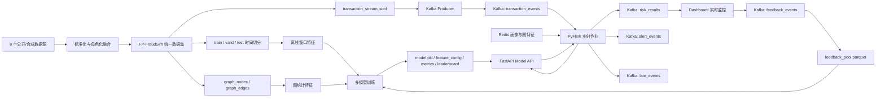

# 方向一：欺诈交易智能识别答辩方案 v3

## 1. 项目定位

本项目选择赛题方向一“欺诈交易智能识别”，面向第三方支付跨时段、跨渠道交易风控场景，构建了一个可训练、可流式回放、可在线推理、可反馈迭代、可多模型热插拔的智能反诈系统。

v3 相比 v2 的主要新增：

```text
1. 完成 LightGBM / XGBoost / CatBoost / sklearn / IsolationForest 多模型训练与对比
2. Dashboard 和 Model API 已支持多模型热插拔
3. 完成本机 Docker 环境下的流式端到端压测
4. 完成 API 单笔推理和批量推理低延迟验证
5. 补充混合云适配的最低验证方案和边界说明
6. 基于压测瓶颈完成在线阈值校准、HTTP 连接复用和微批量推理验证
```

当前系统链路：

```text
8 个公开/合成数据源
    -> FP-FraudSim 多源异构统一数据集
    -> 离线窗口特征 + 图统计特征
    -> 多模型训练与评估
    -> FastAPI 模型服务
    -> Kafka 交易流回放
    -> Flink 在线窗口特征计算 + Redis 画像关联
    -> risk_results / alert_events / late_events
    -> Dashboard 人工审核反馈
    -> feedback_events / feedback_pool
    -> 反馈样本重训与模型热加载
```

## 2. 系统架构



核心组件：

| 组件 | 当前实现 | 作用 |
|---|---|---|
| Kafka | `apache/kafka:3.7.0` KRaft 单节点 | 交易、风险、告警、反馈事件消息总线 |
| Flink | PyFlink 1.18 | 实时窗口特征、画像关联、模型调用、告警分流 |
| Redis | Redis 7 | 用户、商户、设备、IP、图统计画像 |
| Model API | FastAPI | 模型加载、风险评分、多模型热切换、批量推理 |
| Dashboard | HTML + JS | 模型热切换、指标查看、实时 Topic 查看、人工反馈提交 |
| Trainer | Python | LightGBM、XGBoost、CatBoost、sklearn、IsolationForest 训练 |
| Batch Worker | Python Kafka consumer | 可选微批量推理验证，将结果写入 `risk_results_batch` |

## 3. 数据与特征体系

FP-FraudSim 采用角色化融合，而不是简单拼接多个数据表：

| 数据源 | 在本项目中的角色 |
|---|---|
| PaySim | 移动支付、转账、提现等交易骨架 |
| BankSim | 用户属性、商户类别、用户-商户消费网络 |
| IEEE-CIS | 电商支付、卡、设备、身份和高维匿名特征 |
| CreditCard Fraud | 极度类别不平衡欺诈识别对照 |
| Elliptic Bitcoin | 非法资金流图和链路结构 |
| DGraph-Fin | 金融用户关系图和风险传播 |
| SAML-D | 大规模 AML 交易流和流式压测来源 |
| AMLSim | 洗钱链路、环路、扇入扇出等仿真模式参考 |

v3 当前模型使用 67 个特征，覆盖：

| 特征维度 | 说明 |
|---|---|
| 交易基础特征 | 金额、渠道、支付方式、交易类型、币种、国家/地区、时间字段 |
| 静态画像特征 | 用户交易画像、设备绑定画像、IP 地理画像、商户收款画像 |
| 在线窗口特征 | 用户 5 分钟/1 小时、设备 10 分钟、IP 10 分钟、商户 1 小时窗口 |
| 图统计特征 | 付款方图度数、欺诈邻边数/比例，收款方、商户、设备、IP 图度数 |

关键点：

```text
窗口特征已经同时进入离线训练和 Flink 在线推理链路。
图统计特征已经入模，用于补充团伙关联和欺诈邻域风险。
训练切分按 timestamp 时间切分，避免未来信息泄露。
```

## 4. 多模型训练与评估

当前已完成 7 类模型对比：

```text
LightGBM
XGBoost
CatBoost
sklearn_hgb
sklearn_extra_trees
sklearn_logistic
sklearn_isolation_forest
```

效果对比：

| 模型 | PR-AUC | ROC-AUC | F1@0.8 | FPR@0.8 | 结论 |
|---|---:|---:|---:|---:|---|
| LightGBM | 0.9727 | 0.9949 | 0.9169 | 0.0034 | PR-AUC 最佳，综合最稳 |
| XGBoost | 0.9719 | 0.9947 | 0.9178 | 0.0031 | F1@0.8 最佳，可作为 challenger |
| sklearn_hgb | 0.9702 | 0.9946 | 0.9132 | 0.0053 | 轻量强 baseline |
| CatBoost | 0.9701 | 0.9946 | 0.9152 | 0.0049 | 接近 sklearn_hgb，稳定 |
| ExtraTrees | 0.9511 | 0.9904 | 0.8245 | 0.0005 | 误报极低，但召回偏保守 |
| LogisticRegression | 0.8573 | 0.9607 | 0.7923 | 0.0138 | 线性 baseline |
| IsolationForest | 0.5962 | 0.8060 | 0.4854 | 0.0011 | 无监督异常检测 baseline |

指标解释：

| 指标 | 含义 |
|---|---|
| PR-AUC | Precision-Recall 曲线面积，更适合欺诈检测这种类别不平衡任务 |
| ROC-AUC | 模型区分正常和欺诈交易的整体能力 |
| F1@0.8 | 当 `risk_score >= 0.8` 判为高风险时，Precision 和 Recall 的综合表现 |
| FPR@0.8 | 当 `risk_score >= 0.8` 判为高风险时，正常交易被误判为高风险的比例 |

答辩结论：

```text
LightGBM 是当前主模型，因为 PR-AUC 最高，整体排序能力最稳。
XGBoost 在固定高风险阈值 0.8 下 F1 略优，可以作为 challenger 模型。
ExtraTrees 误报率最低，适合极低误杀策略，但会牺牲召回。
IsolationForest 作为无监督异常检测 baseline，用于说明系统也支持未知风险挖掘路线。
```

## 5. 模型热插拔与迭代闭环

Dashboard 模型页可以发现并热加载：

```text
models/*/latest/model.pkl
```

API 接口：

| 接口 | 作用 |
|---|---|
| `GET /models` | 查看可用模型和指标 |
| `POST /models/activate` | 热切换模型 |
| `POST /reload` | 重载当前模型 |
| `GET /leaderboard` | 查看模型排行榜 |
| `POST /feedback` | 写入人工审核反馈 |

模型迭代闭环：

```text
risk_results
    -> Dashboard 人工审核
    -> feedback_events
    -> feedback_pool.parquet
    -> train_with_feedback
    -> 新模型 metrics / leaderboard
    -> Dashboard 或 API 热加载
```

## 6. 实时检测与在线判断

实时处理链路：

```text
transaction_stream.jsonl
    -> Kafka Producer
    -> Kafka transaction_events
    -> Flink 实时作业
    -> Redis 画像与图特征
    -> FastAPI /predict
    -> Kafka risk_results / alert_events / late_events
    -> Dashboard 实时页
```

风险输出包含：

```text
risk_score
risk_level
decision
reason_codes
model_name
model_version
scored_at
window_features
graph_features
```

风险阈值：

| 分数区间 | 风险等级 | 决策 |
|---|---|---|
| `risk_score >= high_threshold` | high | reject |
| `medium_threshold <= risk_score < high_threshold` | medium | review |
| `< medium_threshold` | low | pass |

v3 优化后，线上阈值优先读取当前模型 `metrics.json` 中的验证集校准结果：

```text
high_threshold   优先使用 precision_at_least_0_95.threshold
medium_threshold 优先使用 recall_at_least_0_90.threshold
```

当前 LightGBM 在线阈值：

```text
medium = 0.73
high   = 0.80
```

这避免了不同模型热切换后仍然硬套同一个固定阈值的问题。

## 7. 高并发与低延迟验证

由于本地没有多服务器或云资源，v3 采用“单机 Docker 最小验证”方式，不声称完成真实生产级混合云压测。

### 7.1 服务状态验证

当前已验证：

```text
Kafka: healthy
Redis: healthy
Model API: healthy
Flink JobManager: running
Flink TaskManager: running
Flink risk job: RUNNING
Dashboard: 200 OK
```

Flink 当前运行作业：

```text
status = RUNNING
parallelism = 2
```

### 7.2 端到端流式压测

压测命令：

```powershell
python -m fraudsim.streaming.benchmark `
  --dataset fp_fraudsim_injected `
  --bootstrap-servers localhost:9094 `
  --limit 1000 `
  --timeout 180
```

压测结果：

| 压测项 | 发送 | 收到风险结果 | 端到端吞吐 | 平均延迟 | P95 | P99 |
|---|---:|---:|---:|---:|---:|---:|
| burst 1000, parallelism=1 | 1000 | 978 | 5.40/s | 56.01s | 103.18s | 107.62s |
| burst 500, parallelism=2 | 500 | 470 | 2.61/s | 27.61s | 47.93s | 50.09s |

解释：

```text
该压测证明 Kafka -> Flink -> Model API -> Kafka risk_results 链路可运行。
但它也暴露了 MVP 的主要瓶颈：PyFlink 当前同步逐笔 HTTP 调用模型服务，不适合高 burst 流量。
因此本项目目前可以证明“架构可扩展、链路可运行”，不能声称已经达到生产级高并发。
```

### 7.3 Model API 低延迟验证

单笔推理压测，100 次请求：

| 指标 | 结果 |
|---|---:|
| 平均延迟 | 118.25 ms |
| P50 | 115.98 ms |
| P95 | 149.10 ms |
| P99 | 169.51 ms |
| 最大值 | 191.64 ms |

批量推理压测，100 笔一批，20 次请求：

| 指标 | 结果 |
|---|---:|
| 平均 batch 延迟 | 145.74 ms |
| P95 batch 延迟 | 198.82 ms |
| 平均单笔摊销 | 1.46 ms |
| P95 单笔摊销 | 1.99 ms |

结论：

```text
模型服务本身具备低延迟潜力，尤其是批量推理时单笔摊销约 1.46ms。
当前端到端瓶颈主要在 Flink 同步逐笔调用。
v3 已验证微批量推理路径，生产版将该路径迁移到 Flink async I/O 或 keyed micro-batching 后，可以显著提升端到端吞吐。
```

### 7.4 针对瓶颈的优化验证

基于端到端压测暴露的问题，已完成三项低风险优化：

| 优化项 | 状态 | 作用 |
|---|---|---|
| Model API 读取校准阈值 | 已完成 | 不同模型使用各自验证集阈值，避免固定 0.8 一刀切 |
| Flink HTTP 连接复用 | 已完成 | `WindowScorer` 使用 `requests.Session`，减少逐笔新建连接开销 |
| 微批量推理 worker | 已完成验证 | 用 `records[]` 批量调用 `/predict`，输出到 `risk_results_batch` |

微批量验证命令：

```powershell
python -m fraudsim.streaming.batch_risk_worker `
  --risk-topic risk_results_batch `
  --batch-size 50 `
  --limit 100
```

验证结果：

```text
processed = 105
risk_results_batch_observed = true
输出结果包含 calibrated thresholds: medium=0.73, high=0.80
```

解释：

```text
该 worker 是优化路径验证，不替代主 Flink 作业。
它证明系统已经具备从“逐笔同步 HTTP”升级到“微批量模型推理”的工程基础。
生产版本应将该思路迁移为 Flink async I/O 或 checkpointed keyed micro-batching。
```

## 8. 混合云部署适配验证

本地没有多台服务器，因此采用“容器化 + 服务解耦 + 单机模拟”的最低验证方式。

当前系统已经满足混合云部署的基础设计条件：

| 能力 | 当前验证 |
|---|---|
| 服务容器化 | Kafka、Flink、Redis、Model API、Dashboard 均由 Docker Compose 编排 |
| 服务解耦 | Kafka topic 和 HTTP API 连接各模块 |
| 数据/模型独立挂载 | `data/processed` 和 `models/` 以 volume 形式挂载 |
| 模型热更新 | API 支持 `/reload` 和 `/models/activate` |
| 计算横向扩展设计 | Flink TaskManager 和模型服务均可按服务副本扩展 |
| 公私域拆分能力 | 数据与画像可部署私有云，模型服务/展示层可部署公有云或边缘节点 |

建议的混合云部署映射：

| 部署域 | 放置组件 | 原因 |
|---|---|---|
| 私有云/本地数据中心 | 原始数据、画像库、Redis、模型文件、反馈池 | 数据敏感，便于合规和访问控制 |
| 流式计算集群 | Kafka、Flink | 需要高吞吐、可横向扩容 |
| 公有云/边缘节点 | Dashboard、API 网关、部分模型服务副本 | 便于弹性伸缩和低延迟访问 |
| 运维监控区 | leaderboard、metrics、日志、告警 | 支撑审计和模型治理 |

答辩边界说明：

```text
由于本地没有多台服务器，本项目没有声称完成真实跨云部署。
我们完成的是混合云架构的最小可验证实现：服务容器化、模块解耦、数据/模型 volume 化、API 和 Kafka topic 标准化。
这些设计使系统可以从单机 Docker 平滑迁移到私有云 Kafka/Flink 集群和多副本模型服务。
```

## 9. 当前评分项评估

### 9.1 仿真环境与实时检测能力

当前预计：4.5/5。

- 已构建多源异构 FP-FraudSim。
- 已支持交易流回放、实时评分、风险等级和告警输出。
- Dashboard 可查看风险结果并提交人工反馈。

仍可增强：

- 交易生成仍以离线构建后回放为主，还不是可交互调参的在线仿真器。

### 9.2 流式数据处理框架

当前预计：4/5。

- 已采用 Kafka + Flink + Redis + FastAPI。
- 已完成端到端压测，证明链路可运行。
- 压测暴露同步逐笔 HTTP 是瓶颈。
- 已完成 HTTP 连接复用和微批量推理 worker 验证。

仍可增强：

- 生产版仍需将微批量思路迁移到 Flink async I/O 或 keyed micro-batching。
- 将 Python 内存窗口迁移到 Flink Keyed State + RocksDB。

### 9.3 自适应学习与模型迭代能力

当前预计：4.5/5。

- 已支持 feedback_events、feedback_pool、train_with_feedback。
- 已支持多模型 leaderboard 和热加载。
- 已支持 LightGBM、XGBoost、CatBoost 等 challenger 模型。

仍可增强：

- 加入自动调度、漂移监控和 champion/challenger 灰度发布。

### 9.4 多维度特征构建

当前预计：4.5/5。

- 已融合交易、画像、窗口、图统计特征。
- 窗口特征离线/在线口径一致。
- 图统计特征已入模。

仍可增强：

- 完整 GNN、社区发现和多跳证据子图仍是后续增强项。

## 10. 答辩建议话术

关于多模型：

```text
我们没有只训练单一模型，而是接入了 LightGBM、XGBoost、CatBoost、sklearn 树模型、线性模型和 IsolationForest。
从 PR-AUC 看 LightGBM 最优，从固定高风险阈值 F1 看 XGBoost 略优。
这说明系统具备模型热插拔和 challenger 对比能力，后续可以继续接入更多模型。
```

关于高并发和低延迟：

```text
在没有多台服务器的情况下，我们采用单机 Docker 完成最低验证。
端到端压测证明 Kafka、Flink、Model API、risk_results 链路可运行，但也暴露了当前 MVP 的同步逐笔调用瓶颈。
API 单笔推理 P95 约 149ms，批量 100 笔时单笔摊销约 1.46ms，说明模型服务本身具备低延迟潜力。
我们已补充 HTTP 连接复用和微批量 batch worker 验证，下一步应把该路径迁移到 Flink async I/O 和多副本 API。
```

关于混合云：

```text
我们没有在本地资源条件下假装完成真实跨云部署，而是完成了混合云适配的工程基础。
系统组件全部容器化，模块之间通过 Kafka topic 和 HTTP API 解耦，数据和模型以 volume 挂载。
因此可以将敏感数据和画像部署在私有云，将 Kafka/Flink 部署为流式计算集群，将 Dashboard/API 网关部署在公有云或边缘节点。
```

## 11. 当前结论

v3 的核心结论：

```text
本项目已经从单模型流式 MVP 扩展为多模型、可热插拔、可反馈迭代的实时反诈系统。
当前 LightGBM 是 PR-AUC 最优主模型，XGBoost 是 F1@0.8 最优 challenger。
系统已完成本机 Docker 下的混合云最小验证和端到端压测，证明链路可运行、服务可解耦、模型服务具备低延迟潜力。
端到端高并发能力的主要瓶颈在 Flink 同步逐笔 HTTP 调用；v3 已验证微批量推理路径，后续通过 Flink async I/O、批量推理和多副本模型服务可以进一步提升。
```
