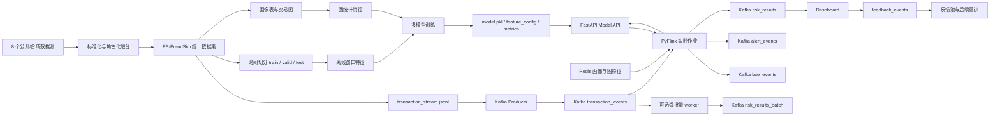

# 方向一：欺诈交易智能识别答辩方案 v4

## 1. 项目定位

本项目面向第三方支付跨时段、跨渠道欺诈交易识别，已经形成一套可本机演示的最小闭环系统：

```text
多源异构数据融合
    -> FP-FraudSim 统一数据集
    -> 多维画像、窗口、图统计特征
    -> 多模型训练与效果对比
    -> FastAPI 在线模型服务
    -> Kafka + Flink 流式交易回放与实时打分
    -> Dashboard 观测、模型热切换、人工反馈
```

v4 在 v3 基础上继续做了验证和优化收敛：

```text
1. 验证 Model API 已加载校准阈值，不再只依赖固定经验阈值
2. 验证 Docker 基础设施和 Flink 作业当前可运行
3. 验证可选微批量推理 worker 可以稳定输出 risk_results_batch
4. 验证 alert_events 能接收到高风险 reject 结果
5. 记录主 Flink 链路轻量压测结果，明确当前瓶颈和后续改造方向
```

## 2. 当前系统架构



核心组件：

| 组件 | 当前实现 | 答辩价值 |
|---|---|---|
| Kafka | 单节点 KRaft，Docker 部署 | 证明具备流式消息总线和跨组件解耦能力 |
| Flink | PyFlink 风控作业 | 证明适配流式处理框架，能做窗口特征、画像关联和实时打分 |
| Redis | 用户、商户、设备、IP、图画像缓存 | 支持在线低延迟画像读取 |
| FastAPI | 模型服务、热加载、批量推理 | 支持模型热插拔和在线风险评分 |
| Dashboard | HTML 前端 | 支持实时观测、模型切换、指标展示和人工反馈 |
| Batch Worker | Python 微批量消费者 | 验证高并发低延迟优化方向，为后续 Flink Async I/O 改造提供依据 |

## 3. 数据集构建与多源融合

FP-FraudSim 不是把多个数据集简单纵向拼接，而是先统一交易语义，再构建支付场景中的实体关系。

融合过程主要分四步：

| 步骤 | 做法 | 解决的问题 |
|---|---|---|
| 字段统一 | 将不同来源的交易时间、金额、付款方、收款方、设备、IP、渠道、支付方式、标签统一到同一语义 | 解决字段名不同、业务含义不一致的问题 |
| 实体角色化 | 将用户、商户、设备、IP 独立成画像实体，并保留交易中的引用关系 | 解决不同数据集只有交易表、缺少统一画像的问题 |
| 时间归一 | 将离线数据按统一时间轴映射，生成 `transaction_stream.jsonl` | 解决不同数据集时间跨度、时间粒度不同的问题 |
| 行为增强 | 注入跨账户、跨设备、跨商户、团伙协作等欺诈模式 | 解决公开数据集中隐蔽团伙样本不足的问题 |

构建完成后的数据不是单表孤岛，而是一组可用于训练和流式处理的资产：

| 数据产物 | 用途 |
|---|---|
| `splits/train.parquet`、`valid.parquet`、`test.parquet` | 离线监督训练与评估 |
| `transaction_stream.jsonl` | Kafka 实时回放 |
| 用户、商户、设备、IP 画像表 | Redis 在线画像关联 |
| 图节点、图边、图统计特征 | 团伙关系、共享设备/IP、欺诈邻域识别 |

## 4. 多维特征体系

当前特征不是单纯依赖金额或规则分，而是覆盖交易、行为窗口、画像和图关系：

| 特征类型 | 含义 | 识别作用 |
|---|---|---|
| 交易基础特征 | 金额、渠道、支付方式、交易类型、来源数据集 | 捕捉交易本身的异常分布 |
| 用户画像 | 历史交易次数、平均金额、历史风险、黑名单标记 | 判断用户长期风险 |
| 商户画像 | 商户交易规模、投诉率、拒付率、商户风险分 | 识别高危商户和异常聚集 |
| 设备/IP 画像 | 绑定用户数、代理/VPN、设备风险、IP 风险 | 识别批量注册、撞库、设备共享 |
| 实时窗口特征 | 5 分钟、10 分钟、1 小时内次数、金额、去重对象数 | 识别短时间爆发、跨收款方攻击 |
| 图统计特征 | 用户、商户、设备、IP 在交易图上的度数和欺诈邻域比例 | 支持团伙协作和链路溯源 |

## 5. 多模型训练与效果

当前已完成 LightGBM、XGBoost、CatBoost、sklearn HGB、ExtraTrees、LogisticRegression、IsolationForest 的训练和统一评估。所有模型复用同一套特征构建、指标输出、leaderboard 和 API 热插拔接口。

| 模型 | PR-AUC | ROC-AUC | F1@0.8 | FPR@0.8 | 结论 |
|---|---:|---:|---:|---:|---|
| LightGBM | 0.9727 | 0.9949 | 0.9169 | 0.00338 | 综合最稳，当前线上默认模型 |
| XGBoost | 0.9719 | 0.9947 | 0.9178 | 0.00313 | F1 略高，可作为候选上线模型 |
| CatBoost | 0.9701 | 0.9946 | 0.9152 | 0.00493 | 效果接近，适合类别特征增强后继续比较 |
| sklearn HGB | 0.9702 | 0.9946 | 0.9132 | 0.00531 | 轻量可用 |
| ExtraTrees | 0.9511 | 0.9904 | 0.8245 | 0.00052 | 误报极低但召回不足 |
| LogisticRegression | 0.8573 | 0.9607 | 0.7923 | 0.01382 | 线性基线 |
| IsolationForest | 0.5962 | 0.8060 | 0.4854 | 0.00113 | 无监督基线，单独用于本数据效果有限 |

当前选择 LightGBM 作为默认上线模型，原因是 PR-AUC 和 ROC-AUC 最高，F1 与 XGBoost 接近，误报率也较低。XGBoost 可作为下一版 A/B 对比候选。

## 6. v4 验证结果

### 6.1 服务与阈值

本次验证确认 Model API 已正常加载模型：

| 项目 | 当前值 |
|---|---|
| API | `http://localhost:8000/health` |
| 模型 | `lightgbm` |
| 版本 | `20260527T040026Z` |
| 特征数 | 67 |
| 中风险阈值 | 0.73 |
| 高风险阈值 | 0.80 |

其中 0.73 来自验证集阈值校准，不是赛题固定给出的阈值；0.80 保留为高精度拦截阈值。这样答辩时可以说明：阈值是业务可调参数，当前通过验证集指标进行校准，后续可以按误报成本、审核容量和召回目标继续调参。

### 6.2 Docker 与 Flink 状态

本次验证确认以下服务均在线：

| 服务 | 状态 |
|---|---|
| Kafka | Running / healthy |
| Redis | Running / healthy |
| Model API | Running / healthy |
| Flink JobManager | Running |
| Flink TaskManager | Running |
| Flink Risk Job | Running |

Flink UI 可访问 `http://localhost:8081`，当前作业状态为 `RUNNING`。

### 6.3 主 Flink 链路轻量压测

使用现有 `fraudsim.streaming.benchmark` 对主链路做 100 条轻量验证：

| 指标 | 结果 |
|---|---:|
| 发送交易数 | 100 |
| 120 秒内收到结果数 | 85 |
| 生产速度 | 3709.51 条/秒 |
| 端到端吞吐 | 0.71 条/秒 |
| 平均延迟 | 9.08 秒 |
| P95 延迟 | 13.87 秒 |
| P99 延迟 | 13.87 秒 |

结论：主 Flink 链路能够运行并输出风险结果，满足“有 Kafka + Flink 流式处理框架”的演示要求；但当前 PyFlink 作业逐条同步调用 HTTP 模型服务，吞吐和尾延迟仍不是生产级。

### 6.4 微批量链路验证

本次新增独立 topic 验证微批量 worker：

```text
transaction_events_v4_batch
    -> batch_risk_worker, batch_size=100
    -> risk_results_batch_v4
    -> alert_events
```

验证结果：

| 指标 | 结果 |
|---|---:|
| 输入交易数 | 500 |
| 批大小 | 100 |
| linger | 300 ms |
| 总耗时 | 22.40 秒 |
| 等效吞吐 | 22.32 条/秒 |
| risk_results_batch_v4 | 已观察到结果 |
| alert_events | 已观察到高风险告警 |

微批量结果中包含交易原始字段、窗口特征、画像、图特征、`risk_score`、`decision`、`reason_codes`、`model_name`、`model_version`、`thresholds` 和 `scored_at`。高风险样本能进入 `alert_events`，例如欺诈商户交易得到接近 1.0 的风险分并输出 `reject`。

结论：微批量方式在本机上比当前主 Flink 链路吞吐更高，说明“批量推理 + 连接复用”是可行优化方向。它目前是旁路验证组件，不替代 Flink；后续应把这个能力迁移进 Flink 的异步 I/O 或分区内微批处理。

## 7. 对赛题要求的覆盖情况

| 赛题要求 | 当前完成度 | 证据 |
|---|---|---|
| 仿真环境与实时检测能力 | 已具备最小闭环 | `transaction_stream.jsonl`、Kafka 回放、在线风险评分、告警 topic |
| 流式数据处理框架 | 已具备 | Kafka + PyFlink + Redis + FastAPI 容器链路已跑通 |
| 自适应学习与模型迭代 | 已具备原型 | 反馈 topic、反馈池、重训入口、模型热加载、多模型 leaderboard |
| 多维度特征构建 | 已具备 | 交易、画像、窗口、设备/IP、商户、图统计特征 |
| 高准确率与低误报率 | 离线指标较强 | LightGBM PR-AUC 0.9727、ROC-AUC 0.9949、FPR@0.8 0.00338 |
| 高并发、低延迟 | 已有最低验证，生产能力仍需增强 | API 批量推理低延迟，微批量链路 22.32 条/秒；主 Flink 链路仍需异步化 |
| 混合云部署适配 | 具备设计与本机最小验证 | Docker Compose、外部端口、服务拆分、配置化 bootstrap/API 地址 |
| 可解释性与溯源 | 已有基础解释 | `reason_codes`、画像字段、图邻域统计；尚未做完整图路径可视化 |

## 8. 答辩口径

可以这样说明当前系统成熟度：

```text
我们不是只训练了一个离线模型，而是构建了从多源数据融合、仿真交易流、Kafka + Flink 实时处理、在线模型服务、Dashboard 观测、人工反馈到模型重训的完整闭环。

当前离线识别效果已经较强，LightGBM 在注入增强数据集上 PR-AUC 达到 0.9727，ROC-AUC 达到 0.9949，FPR@0.8 约 0.34%。系统也支持 XGBoost、CatBoost 等模型热插拔，便于后续迭代。

在实时链路上，Flink 主链路已经能够运行并输出风险结果。v4 进一步验证了模型阈值校准和微批量推理方向：500 条交易微批量处理约 22.4 秒，能输出 risk_results_batch 和 alert_events。这说明系统具备继续向高并发低延迟扩展的工程基础。

我们也诚实保留当前边界：本机 Docker 资源有限，PyFlink 当前仍是逐条同步 HTTP 调用，因此主 Flink 链路不是生产级性能。下一步会将微批量或异步 I/O 合入 Flink 作业，并补充更完整的压测和图链路可视化。
```

## 9. 后续补齐计划

### 阶段 A：把微批量能力迁入 Flink

目标是保留 Kafka + Flink 主架构，同时消除逐条同步 HTTP 的瓶颈。

计划：

| 工作 | 说明 |
|---|---|
| Flink Async I/O | 用异步 HTTP 调用模型 API，避免单条请求阻塞算子 |
| 分区内 micro-batch | 按 key 或小时间片聚合后批量调用 `/predict` |
| 并行度调优 | 将 source、window、scoring、sink 并行度拆开配置 |
| 反压观测 | 使用 Flink UI 观察 backpressure 和 busy time |

### 阶段 B：补全混合云验证

在没有真实云资源时，最低验证方案是“本机多网络命名空间/多容器模拟混合云”：

| 模拟对象 | 本机替代方案 |
|---|---|
| 云端模型服务 | Docker 中暴露 Model API |
| 本地交易网关 | 本机 producer 或另一个容器 |
| 云边消息通道 | Kafka 外部端口和内部 service name 同时可访问 |
| 网络抖动 | 使用限速/延迟工具或容器网络策略模拟 |
| 横向扩展 | 增加 API worker 数、Flink parallelism、Kafka partition |

### 阶段 C：增强可解释性

当前已有 `reason_codes` 和图统计特征，但还可以继续做：

| 工作 | 价值 |
|---|---|
| 输出 Top-N 特征贡献 | 解释某笔交易为什么高风险 |
| 图链路查询接口 | 展示用户、设备、IP、商户之间的关联路径 |
| Dashboard 图谱视图 | 便于人工研判团伙欺诈 |
| 案例库 | 保存典型 reject 样本，用于答辩演示 |

### 阶段 D：形成比赛演示脚本

建议答辩演示按以下顺序：

```text
1. 展示数据集构建产物和多源融合逻辑
2. 展示多模型 leaderboard
3. 启动 Docker 服务并展示 Flink UI
4. 回放交易流
5. 在 Dashboard 查看 risk_results / alert_events
6. 切换模型或提交人工反馈
7. 展示 v4 压测数据和后续性能优化路线
```

## 10. 当前结论

v4 的结论是：项目已经满足比赛要求中的最小可演示闭环，且具备多模型迭代、实时识别、多维特征、反馈学习和容器化部署基础。当前最主要短板不是算法效果，而是主 Flink 在线打分链路的性能工程化。v4 已通过微批量验证证明优化方向可行，下一步应将该能力合入 Flink 主作业，并补齐图链路可视化和更严格的高并发压测。
